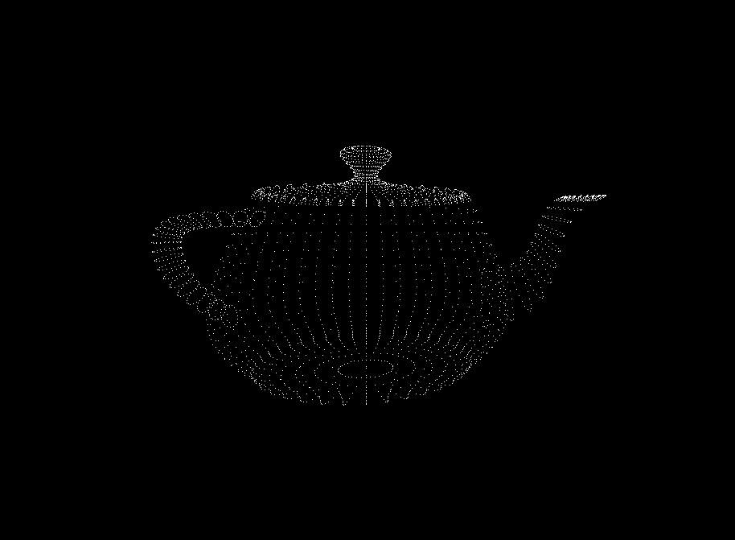

# CUDA Renderer

A simple 3D renderer accelerated with CUDA.



## Controls
- `UP/DOWN`
    - zoom camera in/out
- `LEFT/RIGHT`
    - horizontally pan camera

## To Run
1. download the repo and prepare directories
```bash
git clone https://github.com/shendrew/cuda-renderer
mkdir build && cd build
```
2. build and compile
```bash
cmake -DENABLE_CUDA=<on/off> .. && cmake --build .
```
3. render `.OJB` file
```bash
./cuda_renderer <path-to-obj-file>
```

## Dependencies
```
- CUDAToolkit (offical instructions)
- GLEW
- SDL2
```

To install the dependencies for `Debian/Ubuntu`, run:

```bash
sudo apt install nvidia-cuda-toolkit libglew-dev libsdl2-dev
```